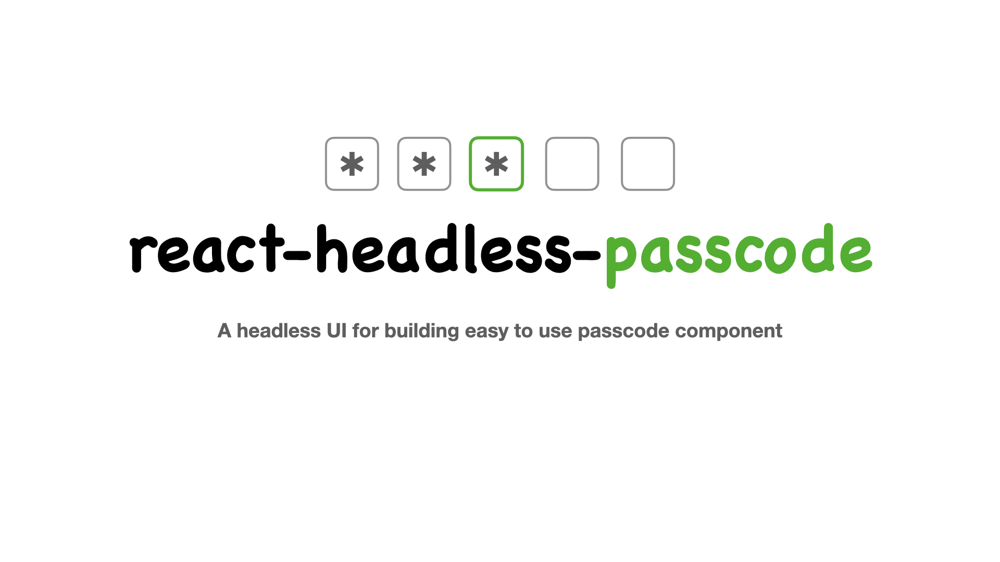

# react-headless-passcode

A headless UI for building easy to use passcode component.

_What is an passcode component?_
It is a group of input elements with each element only accepting one character. This component is generally used in authentication flows.

-   [Installation](#installation)
-   [Usage](#usage)
-   [Features](#features)
-   [API](#api)
-   [Contributing](#contributing)
-   [License](#license)

## Installation

```shell
yarn add @farmisen/react-headless-passcode
```

Or with npm:

```shell
npm install @farmisen/react-headless-passcode
```

## Usage

```tsx
import { usePasscode } from "@farmisen/react-headless-passcode";
```

With the `usePasscode` hook you just need to pass the `count` property and in return you get the `array` in which the actual passcode value is stored, various event hanlders that handles the focus management logic between multiple inputs and `refs` that references each input element.

For example:

```tsx
const PasscodeComponent = () => {
    const { array, getEventHandlers, refs } = usePasscode({
        count: 4,
    });

    return (
        <>
            {array.map((value, index) => {
                const { ...rest } = getEventHandlers(index);
                return (
                    <input
                        className="single-input"
                        ref={(el) => el && (refs.current[index] = el)}
                        type="text"
                        inputMode="numeric"
                        autoComplete="one-time-code"
                        maxLength={1}
                        pattern="\d{1}"
                        value={String(value)}
                        key={`index-${index}`}
                        {...rest}
                    />
                );
            })}
        </>
    );
};
```

> **NOTE:**
> It is important to initialize the `refs` object with the current input element because this is how the `usepasscode` is able to track the current index and manage the focused state across multiple inputs. Make sure to assign this element to the `refs` or else the focus won't change!!

```tsx
ref={(el) => el && (refs.current[index] = el)}
```

## Features

-   Allow entering alpha numeric characters
-   Expose a flag: `isComplete` that tells whether all the input boxes are filled or not
-   Expose a state variable: `currentFocusedIndex`. It tells us the currently focused index of the passcode component.
-   Exposes event handlers that can be seamlessly used with the input element.
-   Passcode value can be pasted partially, fully, from start, or from middle.

## API

The `usePasscode` hook accepts following props
| Prop Name | Type | Description |
|---------------- |------------------------ |----------------------------------------------------------------------- |
| count | `number` | Number of input boxes to create in the passcode component |
| isAlphaNumeric | `boolean` | If `true`, allows to enter alpha numeric value in the component |

The hook returns an object that consists of:

| Property               | Type                                               | Description                                                                                                                                                                          |
| ---------------------- | -------------------------------------------------- | ------------------------------------------------------------------------------------------------------------------------------------------------------------------------------------ |
| passcode               | `(string \| number)[]`                             | The current array value of the entire component.                                                                                                                                     |
| setPasscode            | `function`                                         | A function that sets the internal state variable:`passcode`'s value inside the hook.                                                                                                 |
| currentFocusedIndex    | `number`                                           | Index of the currently focused input element.                                                                                                                                        |
| setCurrentFocusedIndex | `function`                                         | A function that sets the internal state variable: `currentFocusedIndex`'s value inside the hook.                                                                                     |
| getEventHandler        | `function`                                         | A function that accepts an index as a parameter. It returns the following event handlers for the input positioned at index `i`: `onChange` `onFocus` `onKeyUp` `onKeyDown` `onPaste` |
| refs                   | `React.MutableRefObject<HTMLInputElement[] \| []>` | A ref array that contains reference of all the input boxes.                                                                                                                          |
| isComplete             | `boolean`                                          | A boolean flag that tells if all the input boxes are filled or not.                                                                                                                  |

## Contributing

### Commit Standards

This project uses [Conventional Commits](https://www.conventionalcommits.org/) for automatic changelog generation.

| Type | Description | Version Bump |
|------|-------------|--------------|
| `feat` | New feature | Minor |
| `fix` | Bug fix | Patch |
| `docs` | Documentation | None |
| `chore` | Maintenance | None |
| `refactor` | Code refactoring | None |
| `test` | Adding tests | None |

Examples:
```
feat(hook): add onComplete callback
fix(utils): handle empty clipboard
docs: update API reference
```

### Release Process

1. Ensure all changes are merged to `main`
2. Run the release script:
   ```bash
   yarn release          # auto-detect from commits
   yarn release:patch    # patch bump (bug fixes)
   yarn release:minor    # minor bump (new features)
   yarn release:major    # major bump (breaking changes)
   ```
3. Push with tags:
   ```bash
   git push --follow-tags origin main
   ```
4. Create a [GitHub Release](https://github.com/farmisen/react-headless-passcode/releases) from the tag
5. GitHub Actions will automatically publish to GitHub Packages

For more details, see [standard-version](https://github.com/conventional-changelog/standard-version).

## License

React is [MIT licensed](./LICENSE).
